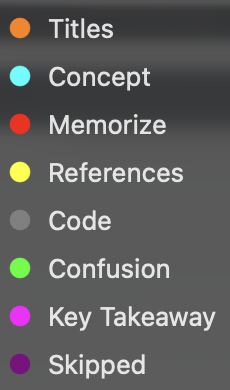

# My Personal Book Collection

my personal collection of books across computer science, hacking, and beyond.

---

| finished | reading | total |
| :------: | :-----: | :---: |
|    5     |    4    |  47   |

---

## contents

<strong>algorithms</strong> &nbsp;<code>5</code>

 

- [ ] Cracking the Coding Interview — Gayle Laakmann McDowell
- [ ] Data Structures and Algorithms in Python — Goodrich, Tamassia, Goldwasser
- [x] Grokking Algorithms — Aditya Y. Bhargava
- [ ] Introduction to Algorithms — Cormen, Leiserson, Rivest, Stein
- [ ] The Algorithm Design Manual — Steven Skiena

<strong>artificial intelligence</strong> &nbsp;<code>2</code>

 

- [ ] Artificial Intelligence — Stuart Russell and Peter Norvig
- [ ] Superintelligence — Nick Bostrom

<strong>hacking</strong> &nbsp;<code>20</code>

 

- [ ] Black Hat Python - Justin Seitz
- [ ] Bug Bounty Bootcamp — Vickie Li
- [ ] Bug Bounty Hunting Essentials - Shahmeer Amir
- [ ] Bug Hunter Diary — Tobias Klein
- [ ] From Day Zero to Zero Day - Eugene Lim
- [ ] Hacking APIs — Corey J. Ball
- [ ] JavaScript For Hackers - Heyes Gareth
- [ ] Mastering Modern Web Penetration Testing - Prakhar Prasad
- [ ] Network Basics for Hackers - OTW
- [ ] Real-World Bug Hunting — Peter Yaworski
- [ ] RTFM Red Team Field Manual — Ben Clark
- [ ] RTFM Red Team Field Manual v2 — Ben Clark, Nick Downer
- [ ] The Browser Hacker's Handbook — Alcorn, Frichot, Orru
- [ ] The Database Hacker's Handbook — Litchfield, Anley, Heasman, Grindlay
- [x] The Linux Command Line - William Shotts
- [ ] The Mac Hacker's Handbook — Charlie Miller and Dino Dai Zovi
- [ ] The Tangled Web - Michal Zalewski
- [~] The Web Application Hacker's Handbook — Stuttard and Pinto
- [~] Web Hacking 101 — Peter Yaworski
- [ ] Web Hacking Arsenal - Rafay Baloch

<strong>programming</strong> &nbsp;<code>4</code>

 

- [ ] Fluent Python — Luciano Ramalho
- [ ] Learning SQL — Alan Beaulieu
- [ ] The C Programming Language — Kernighan and Ritchie
- [ ] The C++ Programming Language — Bjarne Stroustrup

<strong>religion</strong> &nbsp;<code>2</code>

 

- [ ] Forbidden Prophecies — Abu Zakariyah
- [x] The Man in the Red Underpants - A. R. Green

<strong>self-help</strong> &nbsp;<code>14</code>

 

- [ ] 7 Habits of Highly Effective People — Stephen Covey
- [x] As a Man Thinketh — James Allen
- [~] Atomic Habits — James Clear
- [ ] Autobiography of a Yogi — Paramhansa Yogananda
- [ ] Autobiography of Malcom X - Malcom X & Alex Haley
- [ ] Becoming Supernatural — Dr Joe Dispenza
- [~] Deep Work — Cal Newport
- [ ] The Power Of Now - Eckhart Tolle
- [x] The Power of Your Subconscious Mind — Joseph Murphy
- [ ] The Productive Muslim - Mohammed Faris
- [ ] Ultralearning — Scott Young
- [ ] Win Every Argument — Mehdi Hasan
- [ ] Zen Mind, Beginner's Mind — Shunryu Suzuki
- [ ] Zero to One — Peter Thiel

---

## key

- `[x]` → finished
- `[~]` → currently reading
- `[ ]` → unread

---

## annotations in the books

I am using [Highlights](https://highlightsapp.net/) app to take notes in the books, and I have color coded the notes based on the following categories:

---

_last updated: 13 April, 2026_
