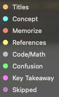

# My Personal Book Collection

my personal collection of books across computer science, hacking, and beyond.

---

| finished | reading | total |
| :------: | :-----: | :---: |
|    7    |    6    |  69   |

---

## contents

<strong>algorithms</strong> &nbsp;<code>5</code>

 

- [ ] Cracking the Coding Interview - Gayle Laakmann McDowell
- [ ] Data Structures and Algorithms in Python - Goodrich, Tamassia, Goldwasser
- [x] Grokking Algorithms - Aditya Y. Bhargava
- [ ] Introduction to Algorithms - Cormen, Leiserson, Rivest, Stein
- [ ] The Algorithm Design Manual - Steven Skiena

<strong>artificial intelligence</strong> &nbsp;<code>6</code>

 

- [ ] **<ins>Artificial Intelligence - Stuart Russell and Peter Norvig</ins>**
- [ ] **<ins>Build a LLM From Scratch - Sebastian Raschka</ins>**
- [ ] Deep Learning - Ian Goodfellow
- [ ] **<ins>How AI Works From Sorcery to Science - Ronald T. Kneusel</ins>**
- [ ] Introduction to Statistical Learning with Python - Gareth James
- [ ] Superintelligence - Nick Bostrom

<strong>hacking</strong> &nbsp;<code>26</code>

 

- [ ] Black Hat GraphQL - Nick Aleks and Dolev Farhi
- [ ] Black Hat Python - Justin Seitz
- [ ] **<ins>Bug Bounty Bootcamp - Vickie Li</ins>**
- [ ] Bug Bounty Hunting Essentials - Shahmeer Amir
- [ ] Bug Hunter Diary - Tobias Klein
- [ ] From Day Zero to Zero Day - Eugene Lim
- [ ] Hacking APIs - Corey J. Ball
- [ ] JavaScript For Hackers - Heyes Gareth
- [ ] Mastering Modern Web Penetration Testing - Prakhar Prasad
- [ ] Network Basics for Hackers - OTW
- [ ] Penetration Testing - Georgia Weidman
- [ ] Practical AI Security - Harriet Farlow
- [ ] Practical Malware Analysis - Michael Sikorski & Andrew Honig
- [ ] Real-World Bug Hunting - Peter Yaworski
- [ ] RTFM Red Team Field Manual - Ben Clark
- [ ] RTFM Red Team Field Manual v2 - Ben Clark, Nick Downer
- [ ] Security Engineering v3 - Ross Anderson
- [ ] The Browser Hacker's Handbook - Alcorn, Frichot, Orru
- [ ] The Database Hacker's Handbook - Litchfield, Anley, Heasman, Grindlay
- [x] The Linux Command Line - William Shotts
- [ ] The Mac Hacker's Handbook - Charlie Miller and Dino Dai Zovi
- [ ] The Tangled Web - Michal Zalewski
- [ ] The Web Application Hacker's Handbook - Stuttard and Pinto
- [ ] **<ins>Web Hacking 101 - Peter Yaworski</ins>**
- [ ] Web Hacking Arsenal - Rafay Baloch
- [ ] Web Security Testing Guide v4.2 - OWASP

<strong>operating system</strong> &nbsp;<code>3</code>

 

- [ ] Mac OSX Internals - A Systems Approach - Amit Singh
- [ ] **<ins>Operating System Design The Xinu Approach - Douglas Comer</ins>**
- [ ] Operating Systems - Three Easy Pieces - Remzi & Andrea

<strong>programming</strong> &nbsp;<code>5</code>

 

- [ ] Eloquent JavaScript - Marijn Haverbeke
- [x] Fluent Python - Luciano Ramalho
- [x] Learning SQL - Alan Beaulieu
- [ ] The C Programming Language - Kernighan and Ritchie
- [ ] The C++ Programming Language - Bjarne Stroustrup

<strong>religion</strong> &nbsp;<code>9</code>

 

- [ ] Divine Speech - Nouman Ali Khan
- [ ] Forbidden Prophecies - Abu Zakariyah
- [ ] Investigation on the Author's Style and the Authenticity of the Holy Quran - Halim Sayoud
- [ ] Miraculous Language of the Quran - Bassam Saeh
- [ ] Structure and Quranic Interpretation - Raymond Farrin
- [ ] The Burhan - Mohammed Hijab
- [ ] The Composition of the Quran - Michael Cuypers
- [x] The Man in the Red Underpants - A. R. Green
- [ ] The Modernist Menace to Islam - Daniel Haqiqatjou

<strong>self-help</strong> &nbsp;<code>15</code>

 

- [ ] 7 Habits of Highly Effective People - Stephen Covey
- [x] As a Man Thinketh - James Allen
- [ ] Atomic Habits - James Clear
- [ ] Autobiography of a Yogi - Paramhansa Yogananda
- [ ] Autobiography of Malcom X - Malcom X & Alex Haley
- [ ] Becoming Supernatural - Dr Joe Dispenza
- [ ] Deep Work - Cal Newport
- [ ] Digital Minimalism - Cal Newport
- [ ] The Official TED Guide to Public Speaking - Chris Anderson
- [ ] The Power Of Now - Eckhart Tolle
- [x] The Power of Your Subconscious Mind - Joseph Murphy
- [ ] The Productive Muslim - Mohammed Faris
- [ ] Ultralearning - Scott Young
- [ ] Win Every Argument - Mehdi Hasan
- [ ] Zen Mind, Beginner's Mind - Shunryu Suzuki

---

## key

- `[x]` → finished
- `[ ]` → **<ins>currently reading</ins>**
- `[ ]` → unread

---

## annotations in the books

I am using [Highlights](https://highlightsapp.net/) app to take notes in the books, and I have color coded the notes based on the following categories:

---

_last updated: 3 August, 2026_
